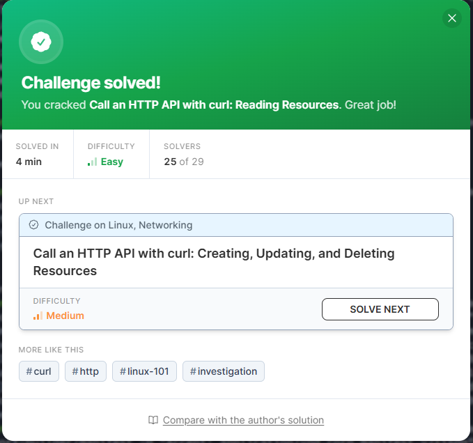
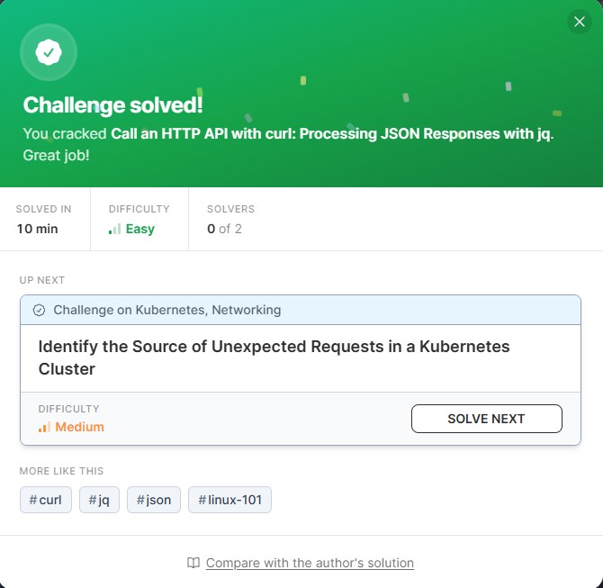
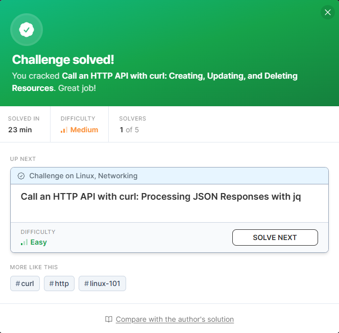

# HTTP
All **highly** familiar topics, but I hadn't touched a raw command line in forever... 

## [Easy] Call an HTTP API with curl: Reading Resources

### Comments
Not much to say here. Pretty familiar stuff on an unfamiliar platform.
### Activities
- Usage of cURL to access a toy API.
- Using the `-H` flag to access request headers.
- Using the `-I` flag to access response headers.
---
## [Easy] Call an HTTP API with curl: Processing JSON data with jq

### Comments
This was an interesting one. Honestly never used `jq` in my life. \
But now I know. Maybe I can create nifty scripts with this now.
### Activities
- Usage of `jq` array filters: `'.foo[].bar`.
- Usage of the `-r` flag to parse as raw plaintext.
- Usage of the `select()` function for conditional filtering: `'.foo[] | select(.bar == "baz")`.
- Usage of `[]` and the `add` function to sum numbers: `[.foo[].bar] | add`.
---
## [Medium] Call an HTTP API with curl: Creating, Updating, and Deleting Resources 

### Comments
Can't say I'm proud of the time I took to complete this challenge, but I suppose \
theory and practice are two different things...
### Activities
- Heavy usage of cURL.
- Accessing a toy API mostly for `CREATE` `PATCH` `PUT` and `DELETE` requests.
- Accessing request headers using the `-H` flag.
- Accessing response headers using the `I` flag.
- Transmitting & reading JSON data over cURL.