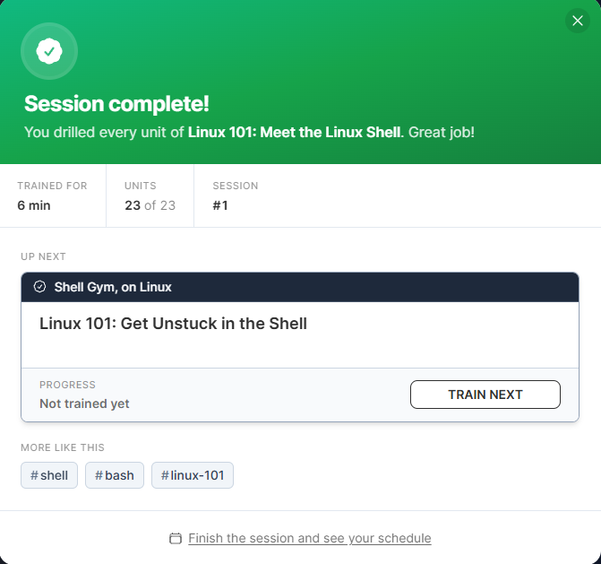

# Shell Gyms
A collection of tutorials with a strategy for retention. 

The content in this section is not meant to be finished once and abandoned; \
the Shell Gym encourages you to come back some time in the future \
(usually the next day) and repeat the tutorial to drill it in.

The `[Training]` tag indicates that I am still working on the particular gym, \
and the `[Completed]` tag indicates that I have completed that gym.
## Linux 101 [Training]

### Comments
Fun activity. I was familiar with the Linux shell before this, but this was \
a nice refresher and it even clarified certain that I hadn't registered before, \
such as flags being mergable and how the `&&` / `||` operands really worked.
### Activities
- Introduction to basic Linux shell commands, such as `whoami`, `hostname,` and `tty`.
- Introduction to basic operands such as `||` and `&&`.
- Introduction to command flags, such as `-u` and `-R` in `date`.
- Introduction to the merging of command flags, such as `-uR` in `date`.
- Introduction to long-form flags, such as `--utc` instead of `-u`.